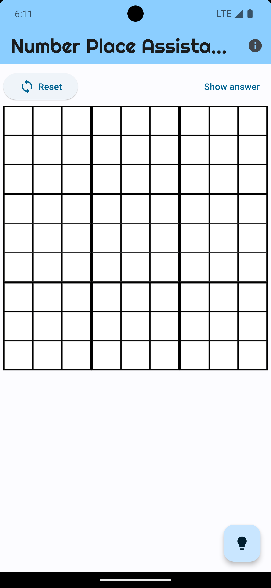

# number_place_assistant

## 1. Introduction
This app assists you to solve the number place. It supports iOS, Android, web, macOS, Windows, and Linux.

## 2. What you can do
* Assist to solve the number place
* Check if an answer of the number place exists
* Show the answer of the number place

## 3. How to use

- Reset
  - Clear all input
- Show answer
  - Show the answer of the number place
- Cells
  - Input numbers from 1 to 9
- i
  - Show licenses
- Question
  - Show a hint of the number place

## 4. List that may be developed in the future
- Show more complex hints
- Support multi-language
- Add automation testing
